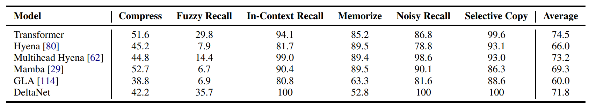
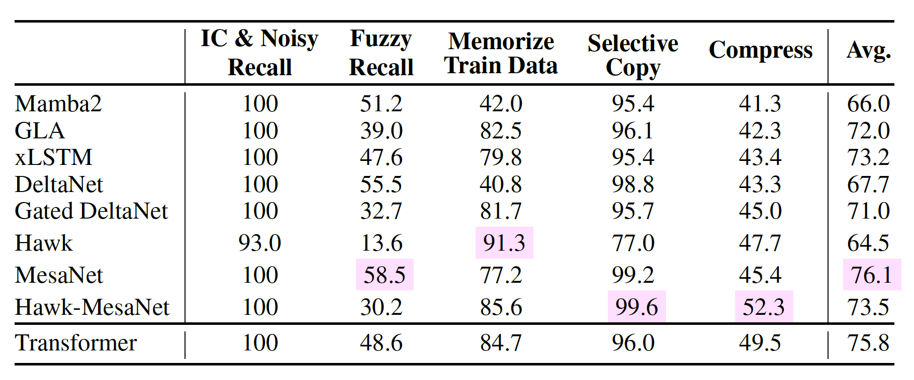
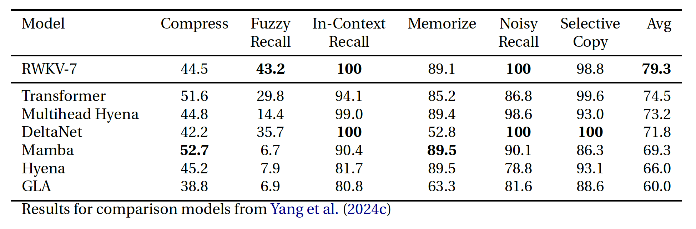
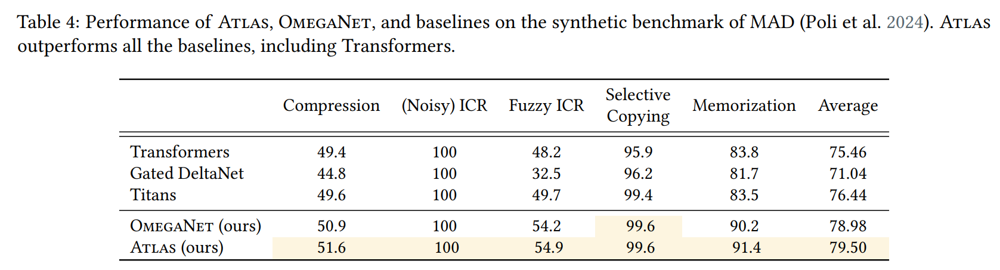

# Linear Attention Benchmarks

Look at all of these results from different papers, supposedly of the same models on the same benchmark:

What's up with that? This repository contains independent and reproducible benchmarking results for various linear attention mechanisms. This should hopefully help to clarify the discrepancies seen in the literature.

Currently, the repository includes (each on own branch):

- Mechanistic Architecture Design (MAD)
- Pre-training loss comparison
